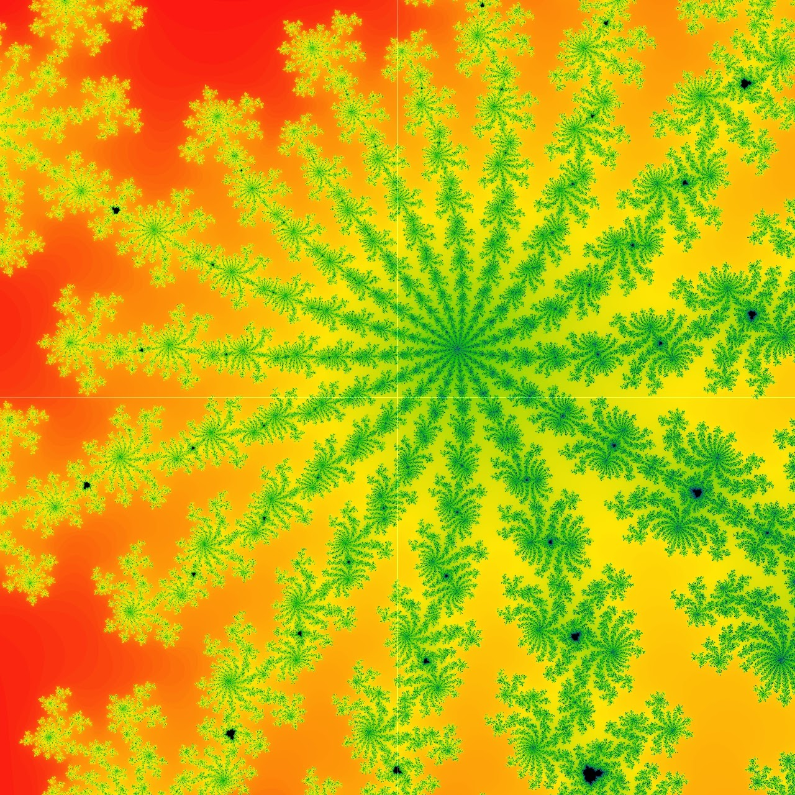
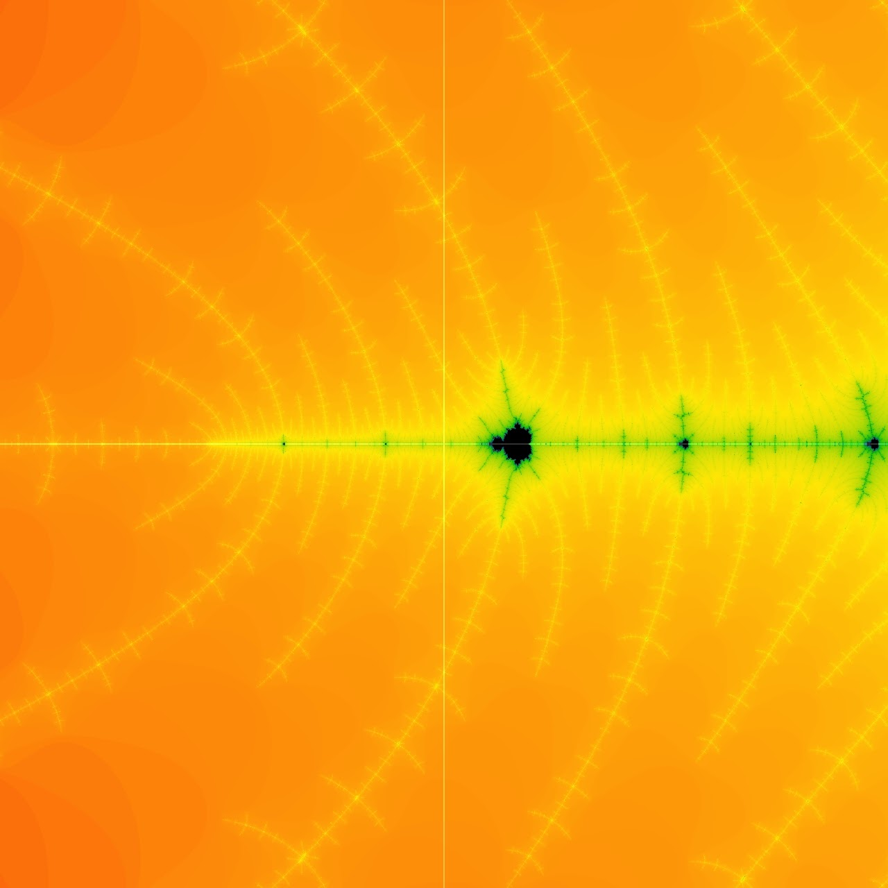

# Cellular Clusters

Inspiration: https://en.wikipedia.org/wiki/Physarum_polycephalum

<-Physarum Rhizomes
<-Cellular Clusters

<-Physarum Rhizomes
M-Celluar Clusters

The output of the GLSL code looks like empty clusters of cells with their walls mushed together.
For my project, I wanted to use the outlines of the physarum rhizomes to fill them up with movement to make it look like a cluster of cells under a microscope.

Changing the implemented sliders will reconfigure the walls and the cells along with it.
All I need to do is use a variety of touchdesigner’s tools to fill and animate those empty cells.
